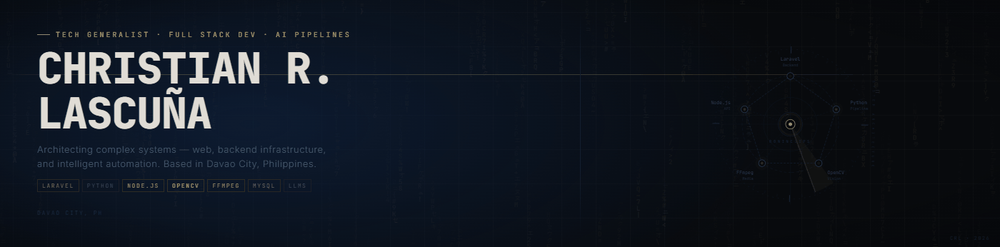

<div align="center">

  <!-- Profile Banner / Animation -->
  

  <br/><br/>

  <!-- Dynamic Typing SVG Headline -->
  <a href="https://github.com/clascuna556171">
    
  </a>

  <br/>

  <!-- Quick Action & Contact Badges -->
  <p align="center">
    <a href="https://christianlascuna.pythonanywhere.com/" target="_blank">
      
    </a>
    <a href="mailto:c.lascuna.556171@umindanao.edu.ph">
      
    </a>
    <a href="https://github.com/clascuna556171" target="_blank">
      
    </a>
    <a href="https://www.linkedin.com/in/christian-lascu%C3%B1a-a1ab24420/" target="_blank">
      
    </a>
</p>

</div>

---

### 💻 System Initialization & Identity

```bash
c_lascuna@tech-generalist:~$ cat << 'EOF' > identity.json
{
  "name": "Christian R. Lascuña",
  "location": "Davao City, Philippines",
  "education": "BS Information Technology — University of Mindanao",
  "role": "Full-Stack Builder & System Architect",
  "current_focus": "Bridging web ecosystems with offline AI automation & computer vision",
  "philosophy": "Engineering high-throughput systems to automate bottlenecks out of existence."
}
EOF

c_lascuna@tech-generalist:~$ ./execute_roninclips.sh --optimize-all
[SYSTEM] Engine loaded: Laravel Core + Python Computer Vision + Whisper AI [ONLINE]
```

---

### 💡 Core Engineering Pillars

| 🌐 Full-Stack Architecture | 🤖 Local & Edge AI | ⚡ Systems & Automation |
| :--- | :--- | :--- |
| • Clean Laravel & Python MVC<br/>• RESTful API Design & Auth<br/>• Optimized Relational Databases | • Offline Whisper Speech-to-Text<br/>• OpenCV Real-time Face Tracking<br/>• Zero-Cloud-Dependency Pipelines | • High-throughput FFmpeg Pipelines<br/>• Bash Scripting & Linux CLI<br/>• Automated Media Workflows |

---

### ⚔️ Featured Project: [RoninClips](https://github.com/clascuna556171/RoninClips)

<table align="center" width="100%">
<tr>
<td>

> **RoninClips** is a production-grade, fully offline media processing product architected from the ground up. It seamlessly bridges a resilient **Laravel web layer** with **Python micro-engines** to extract viral hooks, generate animated word-by-word subtitles, and perform real-time speaker face tracking.

```
   [ Raw Video / Media ]
            │
            ▼
 ┌────────────────────────────────────────────────────────┐
 │           Laravel Orchestration Layer (MVC)            │
 └───────┬───────────────────────────────┬────────────────┘
         │ (Sub-process dispatch)        │ (Job Queue)
         ▼                               ▼
 ┌──────────────────────────┐    ┌──────────────────────────┐
 │  Local Whisper AI Model  │    │   OpenCV Face Tracker    │
 │ (Word-level timestamps)  │    │  (Dynamic 9:16 centering)│
 └───────┬──────────────────┘    └───────┬──────────────────┘
         │                               │
         └───────────────┬───────────────┘
                         ▼
       ┌───────────────────────────────────┐
       │     FFmpeg Processing Engine      │
       │ (Burn-in captions & render hook)  │
       └─────────────────┬─────────────────┘
                         ▼
            [ 🎬 Viral Output Ready ]
```

<p align="left">
  
  
  
  
  
</p>

👉 **[Explore the RoninClips Repository ➔](https://github.com/clascuna556171/RoninClips)**

</td>
</tr>
</table>

---

### 🛠️ Tech Stack & Engineering Arsenal

<div align="center">

#### 🌐 Core Backend & Full Stack
<p align="center">
  
</p>

#### 🤖 AI, Computer Vision & Media Pipelines
<p align="center">
  
  
  
</p>

#### 🗄️ Systems, Databases & DevOps
<p align="center">
  
</p>

</div>

---

### 📊 System Telemetry & GitHub Activity

<div align="center">

  <!-- Live Contribution Waveform Graph -->
  

  <br/><br/>

  <!-- High-Uptime Streak Telemetry Card -->
  

</div>

---

<div align="center">
  <sub>⚡ Engineered with precision by <b>Christian R. Lascuña</b> • Always open to high-impact collaborations.</sub>
</div>
